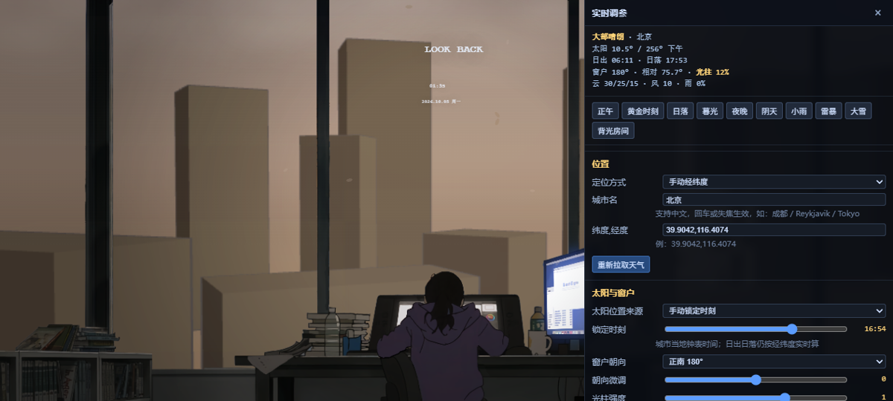

# 蓦然回首 · 实时天气与真实日照

Wallpaper Engine **Web 壁纸**：室内是 2D 手绘，窗外是 **three.js 漫画风 3D 外景**，
由**你所在城市的真实太阳位置**和**当地实时天气**驱动 —— 不是跟随系统时钟。



## 为什么这么做

工坊原作 [3365960230《蓦然回首结尾动态时间变化》](https://steamcommunity.com/sharedfiles/filedetails/?id=3365960230)
（作者 被_整除）用 5 组按时钟切换的预渲染大图 + 18 分钟硬切淡化实现昼夜。
本作把它换成真 3D，于是下面这些在原作里做不到的事都成立了：

| 能力 | 原作 | 本作 |
|---|---|---|
| 昼夜 | 系统时钟小时 | **太阳高度角 + 上午/下午**，换时区/纬度/季节都对得上 |
| 太阳 | 无 | NOAA 算法本地计算，高度角 + 方位角 |
| 光影 | 预渲染图里的死光影 | DirectionalLight + 阴影贴图（太阳不动不重算） |
| 天气 | 无（SceneScript 沙箱不能联网） | open-meteo 实时：云量低/中/高、风速、降水概率、WMO 码 |
| 窗户朝向 | 无 | 8 方位 + 微调，直接决定光柱朝哪偏、影子往哪落 |
| 雨雪 | 手动开关（且那个开关在 `project.json` 里根本没声明，等于死的） | 连续量驱动，真实风向决定倾角 |
| 换图 | 要重画 5 张时段图 | 改楼群 JSON 即可 |

## 跑起来

```bash
# 浏览器里调试（推荐）
tools/preview.cmd          # Windows：起本地服务器并打开 ?panel=1&hud=1

# Wallpaper Engine
#   把 lookback-weather/ 整个复制到
#   %USERPROFILE%\Documents\My Wallpaper\Wallpaper Engine\projects\
#   WE -> 浏览 -> 本地壁纸 -> 选 lookback-weather
```

浏览器里按 **P** 开调参面板、**H** 开 HUD。

## 调参面板

- **位置**：IP 定位 / 城市名 / 经纬度（太阳位置只依赖经纬度，**断网也能用真实日出日落**）
- **太阳与窗户**：太阳来源（真实/系统时钟/锁定时刻）、锁定小时、窗户 8 方位 + 微调、光柱强度
- **天气**：实时开关、低/中/高云量、风速、降水概率、WMO 天气码强制、天气刷新间隔
- **楼群布局**：表格表单，实时改每栋楼的 `x / z / 宽 / 深 / 层 / 偏转 / 可见 / 素材 / 近景`，
  改完点「应用」重建；鼠标移到某行，3D 里那栋楼会被青色线框框出。
  自动存浏览器（刷新不丢）、可撤销、可粘贴 JSON 导入导出。
- **画面**：叶子、雨量、光柱、视差、标题/署名、HUD

## 结构

```
lookback-weather/
  project.json      WE 项目定义（type: web + 29 项用户属性）
  index.html        两个画布：#gl 三维背景 / #stage 二维层（靠 alpha 自然合成）
  js/config.js      虚拟画布、图层清单、时间槽位、WMO 天气表
  js/sun.js         NOAA 太阳位置、天色 LUT、槽位权重
  js/weather.js     定位 + open-meteo + 统一 EnvState（超时/兜底/缓存）
  js/city3d.js      three.js 3D 外景（城市/光照/天空/云）+ 楼群布局
  js/scene.js       2D 图层加载、cover 适配、变换与绘制原语
  js/sunshade.js    2.5D 高度场太阳阴影（仅 2D 模式）
  js/render.js      合成器（图层栈 + 调色 + 粒子调度 + 两模式切换）
  js/particles.js   雨雪、飘落物、雾、光柱
  js/panel.js       调参面板（预设 + 楼群表格表单）
  js/main.js        WE 接口 + 主循环
  js/vendor/three.min.js   离线打包（不能走 CDN）
  assets/           ⚠️ 素材不入库，见 assets/README.md
tools/
  extract_assets.py     从 scene.pkg 提取 .tex 内嵌 PNG
  fbx_to_bin.py         Blender: FBX -> 紧凑二进制
  make_facade_cells.py  立面图集切可平铺开间
```

伪 2D 的关键：`屋内.png` 的 **alpha 通道正好是一张干净窗洞**（白=窗框/窗台/桌面，黑=通透的窗外），
所以 3D 垫在下面、室内画在上面就行，不需要任何抠图或遮罩。

## 几个踩过的坑

1. **WE 场景坐标 +y 朝上**，Canvas +y 朝下。全局矩阵翻转 Y 后 `drawImage` 会被一起镜像，
   **负高度并不能抵消**（实测 flip+(-h) 与 flip+(+h) 完全一样，都是倒的）→ 必须绘制前 `scale(1,-1)`。
2. **粒子方向同理**：`d.y += v` 在 y 向上坐标系里是往上飘。统一用速度矢量，`vy < 0` 才是下落。
3. **风需要标量 + 方向**，且任何一项缺失都会让 `sin()` 变 NaN，而 NaN 会顺着 `x += vx*dt`
   污染所有粒子坐标 —— 整片雨会**静默消失**。`weather.js` 里对两者都做了 `isFinite` 兜底。
4. **太阳算法不能用 `getUTCHours()` 再减时区偏移**（时区算两遍）；**NOAA 方位角公式前面那个负号不能少**
   （少了正午会算出 azimuth≈1°）。
5. **天空球 `depthWrite:false` 会让后面的东西画到天空前面** —— 一张雾化板就把正午糊成白纸。
6. 叠加层的混合模式不能混：阴影要 `multiply`（压暗），受光要 `screen`（提亮），
   塞进同一张图用 `screen` 的话**阴影遇到深色等于什么都没做**。
7. `[type = a, b]` 这种写法在 `'use strict'` 下会抛 ReferenceError；`if (obj.onXxx)` 里
   字段默认是 `null` 时条件永远为假，钩子挂不上。

## 数据来源（全部免费、无需 API Key）

| 用途 | 接口 |
|---|---|
| 天气 + 日出日落 | `api.open-meteo.com` |
| 城市名 → 经纬度 | `geocoding-api.open-meteo.com` |
| IP 定位（兜底） | `ipwho.is` → `get.geojs.io` |

IP 定位不可靠（会 429，代理/VPN 会定位到别的城市），默认建议手动填城市名。

## 素材与授权

本仓库**只含代码**，不含任何美术素材 —— `assets/` 已在 `.gitignore` 里。
房间与人物来自工坊 3365960230（作者 被_整除），3D 建筑素材来路不明，
两者都请自行准备、**在发布到创意工坊前替换成你有权使用的素材**。

third-party 代码：`js/vendor/three.min.js`（three.js，MIT）。
